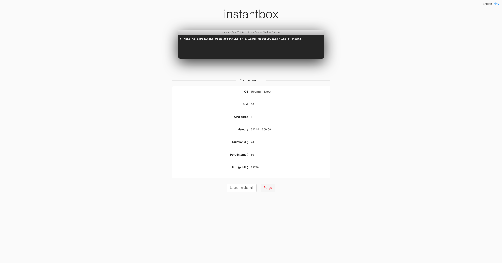

<div align="center">


# instantbox

Get a clean, ready-to-go Linux box in seconds.

</div>

## Introduction

### What is instantbox?

It's a project that spins up temporary Linux systems with instant webshell access from any browser.

### What can an instantbox do?

1. Provides a clean Linux environment for a presentation
2. Let students experience the charm of Linux at your school or your next LUG meet
3. Run with an inspiration in a clean environment
4. Manage servers from any device
5. Experiment with an open source project
6. Test software performance under resource constraints

and more! ideas are endless...

### Which Linux distributions are available?

We currently supports various versions of Ubuntu, CentOS, Arch Linux, Debian, Fedora and Alpine.

## Quickstart



## Deploy

Prerequisite: docker [[More Information]](https://docs.docker.com/install/)

```bash
mkdir instantbox && cd $_
bash <(curl -sSL https://raw.githubusercontent.com/pythoninthegrass/instantbox/master/init.sh)
```

## Credits

* [Upstream project](https://github.com/instantbox/instantbox)
  * Brilliant idea! Just needs some TLC and decoupling of unmaintained dependencies.
* [tsl0922/ttyd](https://github.com/tsl0922/ttyd)

## License

[MIT](LICENSE)
